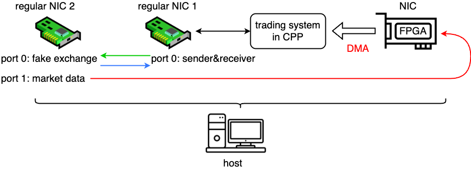
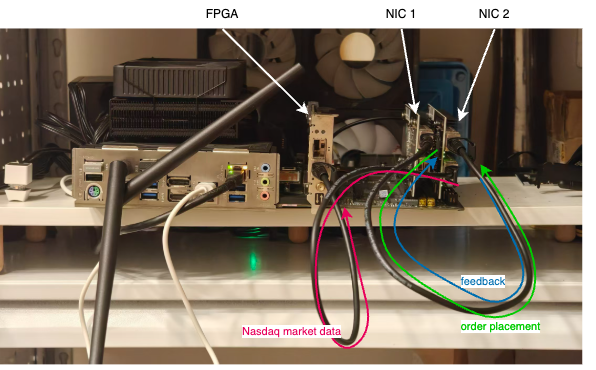
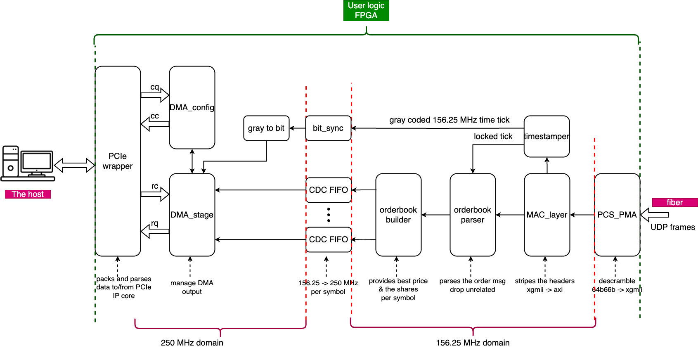
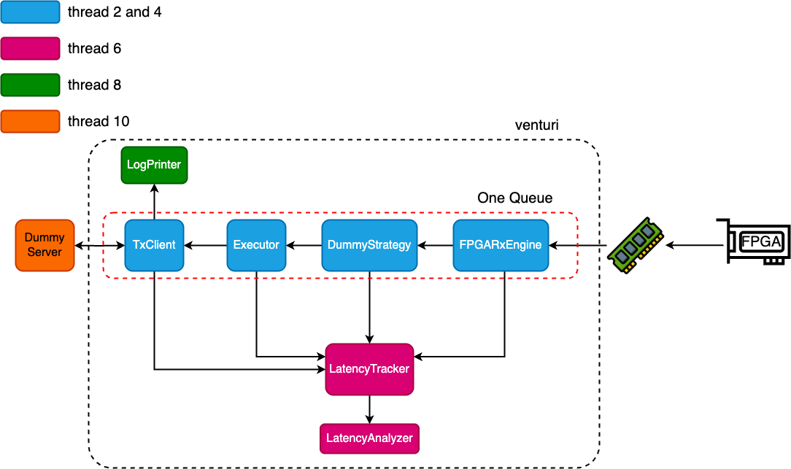

# Venturi
## Prelude
Venturi is an FPGA-plus-host framework for building and measuring a low-latency market-data-to-order pipeline. Its main purpose is latency tracking rather than trading itself.

It is not a perfect project. The aim is to scaffolding the project and pile up gradually, to see how far I can get.

## To do:
1. Check the latency jitter both in userspace code and in the kernel path.
2. Considering add DPDK front-end for data receiving, parallel with FPGA.

## Introduction
The system receives Nasdaq ITCH 5.0 market data on the FPGA, builds top-of-book state in hardware, exports event records to host memory through PCIe DMA, and runs a host-side demo pipeline that can send orders to a simulated exchange. Latency is tracked across the software and hardware stages of this flow, except for PCIe transmission latency.

When `venturi` is stopped with `Ctrl+C`, it prints summary statistics for each tracked stage, including `min`, `p50`, `p99`, and `max`.

This repository contains:

- FPGA RTL for market-data receive, parsing, order-book updates, timestamping, and DMA
- C++ host runtime for polling FPGA events, running demo strategy logic, sending orders, and measuring latency
- a `dummy_server` process for exercising the TX path

## Structure
 

The schematic above shows the end-to-end purpose of Venturi: receive market data on the FPGA, build book state in hardware, export compact events to the host through PCIe DMA, and drive a host-side demo order path while measuring latency across the pipeline. The setup diagram below shows how the FPGA board, host runtime, replay source, and simulated exchange fit together during development and testing.



### FPGA side

The FPGA board is Exanic x10 from Cisco. But the schematic cannot be found on the internet. I referred to the project `Corundum` for the constraint. Need to mind that the polarity of rx is reversed (So in the PCS/PMA IP core, it should be tied to 1). 

On the FPGA side, Venturi focuses on the hot path from packet ingress to DMA emission. Market data enters through the Ethernet MAC path, is parsed into order-book updates, and is reduced into event records that are useful to the host. Along the way, the design also captures timestamps and debug counters so the hardware stages can be inspected and correlated with host-side measurements.



### host side

On the host side, Venturi polls the DMA rings, decodes FPGA-generated events, and feeds them into a small demo strategy and TX pipeline. The host runtime is also responsible for collecting latency records, printing run summaries, and talking to the `dummy_server` that stands in for an exchange during local experiments. Together, the host and FPGA sides form a complete measurement-oriented loop rather than just an isolated parser or transport demo.



## Run

Build the host runtime:

```bash
cd Venturi
cmake -S cpp_src -B cpp_src/build
cmake --build cpp_src/build
```

Before running, the usual host preparation is:

```bash
sudo ./scripts/reset_pcie.sh <BDF-or-vendor:device>
sudo ./scripts/setup-hugepages.sh
sudo ./scripts/setup-vfio.sh <pci_addr1> [pci_addr2] [pci_addr3]
sudo ./scripts/port_isolation.sh <dev>
```

For the TX demo path, it is useful to keep `venturi` and `dummy_server` in different network namespaces so the traffic path is less affected by netfilter and other host networking activity. The helper script below sets up a peer namespace for `dummy_server`.

If you want to isolate hot CPUs at boot, set the kernel command line in `/etc/default/grub` and rebuild GRUB. The usual knobs here are `isolcpus=`, `nohz_full=`, `rcu_nocbs=`, and `irqaffinity=`.

Run the demo with three terminals.

Terminal 1: start the dummy exchange:

```bash
sudo ip netns exec <dummy_server_namespace> ./cpp_src/build/dummy_server
```

Terminal 2: run the host runtime:

```bash
sudo ip netns exec <venturi_namespace> ./cpp_src/build/venturi
```

Terminal 3: feed market data into the FPGA path, for example with `tcpreplay`:

```bash
sudo tcpreplay -i <replay-interface> market_data/ONE_MSG_ONE_FRAME.pcap
```

For short smoke tests, `market_data/ONE_MSG_ONE_FRAME.pcap` is enough, but it only contains four packets total:

- HSBC `A`
- HSBC `E`
- AAPL `A`
- AAPL `E`

For longer replay runs, prefer:

```bash
sudo tcpreplay -i <replay-interface> market_data/ONE_MSG_ONE_FRAME_EXTENDED_64K.pcap
```

That file contains `64000` packets total, built from the same four-packet pattern with slightly varied `A`-message prices for the two symbols.

For other types, you can refer to `market_data/HSBC_AAPL.pcap`

## Replay Expectations

For `market_data/ONE_MSG_ONE_FRAME.pcap`, each replay loop contains:

- `4` Ethernet/UDP packets total
- `2` packets for HSBC
- `2` packets for AAPL
- `1` queue-worthy `A` and `1` queue-worthy `E` packet per symbol

For `market_data/ONE_MSG_ONE_FRAME_EXTENDED_64K.pcap`, the total is:

- `64000` packets total
- `32000` packets for HSBC
- `32000` packets for AAPL

If both queues are configured correctly, the per-queue receive totals should be balanced for this dataset.

## Print

When `tcpreplay` finished, you can press `ctrl+c` in `venturi` terminal, below will be printed:

```bash
[INFO   ] Venturi/cpp_src/FPGA_boost_demo/fpga_dev/fpga_dev.cpp:30 initHardware(): Initializing FPGA RX hardware...
[INFO   ] Venturi/cpp_src/FPGA_boost_demo/fpga_dev/fpga_dev.cpp:195 _getIOMMUGroupID(): IOMMU Group ID: 14
[INFO   ] Venturi/cpp_src/FPGA_boost_demo/fpga_dev/fpga_dev.cpp:351 _getBARAddr(): BAR0 mapped at 0x7a8356ff4000 (size: 0x4000)
[INFO   ] Venturi/cpp_src/FPGA_boost_demo/fpga_dev/fpga_dev.cpp:136 _readSymbolNum(): Device reports 2 symbols
[INFO   ] Venturi/cpp_src/FPGA_boost_demo/fpga_dev/fpga_dev.cpp:90 setRxRingBuffers(): Configured RX queue 0: IOVA=0x0000000000200000 slots_num=1024 slot_bytes=32
[INFO   ] Venturi/cpp_src/FPGA_boost_demo/fpga_dev/fpga_dev.cpp:90 setRxRingBuffers(): Configured RX queue 1: IOVA=0x0000000000400000 slots_num=1024 slot_bytes=32
TxEvent queue=1 event=ConnectionEstablished
TxEvent queue=0 event=ConnectionEstablished
^CLatency Summary queue=0
total_received=18000 traced=8961 warmup=1000 analyzed=7961

stage                                          min_ns       p50_ns       p90_ns       p99_ns       max_ns
FRAME_START_to_DMA_EMIT                           166          166          166          166          166
BATCH_DURATION                                     55           87          111          121          165
BATCH_END_to_STRATEGY_START                        61           66           93          102          143
STRATEGY_START_to_TX_SEND_ACCEPTED                 22           32           55          113          309
TX_SEND_ACCEPTED_to_TX_SEND_SYSCALL_ENTER           30           34           67          133          316
TX_SEND_SYSCALL_ENTER_to_TX_SEND                  507         1315         1430         1571         2181

Latency Summary queue=1
total_received=18000 traced=8960 warmup=1000 analyzed=7960

stage                                          min_ns       p50_ns       p90_ns       p99_ns       max_ns
FRAME_START_to_DMA_EMIT                           166          166          166          166          166
BATCH_DURATION                                     83           94          121          140          179
BATCH_END_to_STRATEGY_START                        77           91          117          132          187
STRATEGY_START_to_TX_SEND_ACCEPTED                 21           25           50          105          262
TX_SEND_ACCEPTED_to_TX_SEND_SYSCALL_ENTER           30           35           63          131          288
TX_SEND_SYSCALL_ENTER_to_TX_SEND                  379         1293         1413         1536         2705

TxReceiver queue=0 sent=8000 accepted=8000 filled=8000 rejected=0 pending=0 malformed=0 ref_drops=0 connected=1 disconnected=0
TxReceiver queue=1 sent=8000 accepted=8000 filled=8000 rejected=0 pending=0 malformed=0 ref_drops=0 connected=1 disconnected=0
```

Do not stop `venturi` immediately when `tcpreplay` exits. Wait briefly so in-flight host-side tracing and TX completion work can drain before pressing `ctrl+c`.

Need to mention I only trace the first event in a frame. so the latency in FPGA is fixed with provided packets. If there are multiple packets, for example 8, the latency is from 160~ to 400+ ns.

## How To Read The Print

The most important counters have different meanings:

- `queue=<id> total_received=<n> traced=<n>`
  - `total_received` is the count of received first-event records seen by the RX engine for that queue
  - `traced` is the count of latency traces that completed all required host-side stages
  - `traced` is not a raw packet counter, so `traced < total_received` does not automatically mean FPGA packet loss
- `Latency Summary`
  - summarizes only completed traces
  - `traced records` should line up with `traced`
- `TxReceiver ... sent/accepted/filled`
  - these are TX-path order lifecycle counters
  - they are useful for checking whether the host-side order path stayed consistent
- `TxReceiver ... connected/disconnected`
  - these are connection event counters for the dummy exchange path
  - they are not packet counters and should not be used to infer FPGA RX loss

## Validation Checklist

After a replay run, the usual correctness checks are:

- per-queue `total_received` matches the expected dataset split
- per-queue `sent == accepted == filled`
- `rejected == 0`
- `pending == 0`
- `malformed == 0`
- `ref_drops == 0`
- `disconnected == 0` for a normal steady run against `dummy_server`

If `traced < total_received` but the receive and TX counters still match expectations, that indicates a tracing shortfall rather than a receive-path loss.

## Bitstream

Before running the host runtime, program the FPGA with the intended bitstream/image for the current experiment.

Host software results are only meaningful when:

- the programmed RTL matches the code assumptions for queue layout and record format
- the BAR/MMIO register map matches the host binary
- the pcap replay content matches the configured symbol stock-locate values

If you change RTL, rebuild and reprogram the FPGA before drawing conclusions from host prints.

## Isolation Notes

Some host preparation is required for correctness, and some is primarily for cleaner latency measurements:

- Usually required:
  - PCIe reset if the device is in a bad state
  - hugepage setup
  - VFIO setup
- Strongly recommended for stable latency numbers:
  - port isolation
  - separate network namespaces for `venturi` and `dummy_server`
  - CPU pinning and boot-time CPU isolation (`isolcpus`, `nohz_full`, `rcu_nocbs`, `irqaffinity`)

Correctness debugging should be done on the simplest stable setup you can control. Latency benchmarking should use the more isolated setup.

The only missing latency is the PCIe transmission latency. Because we do not have a hardware synced clock source.

