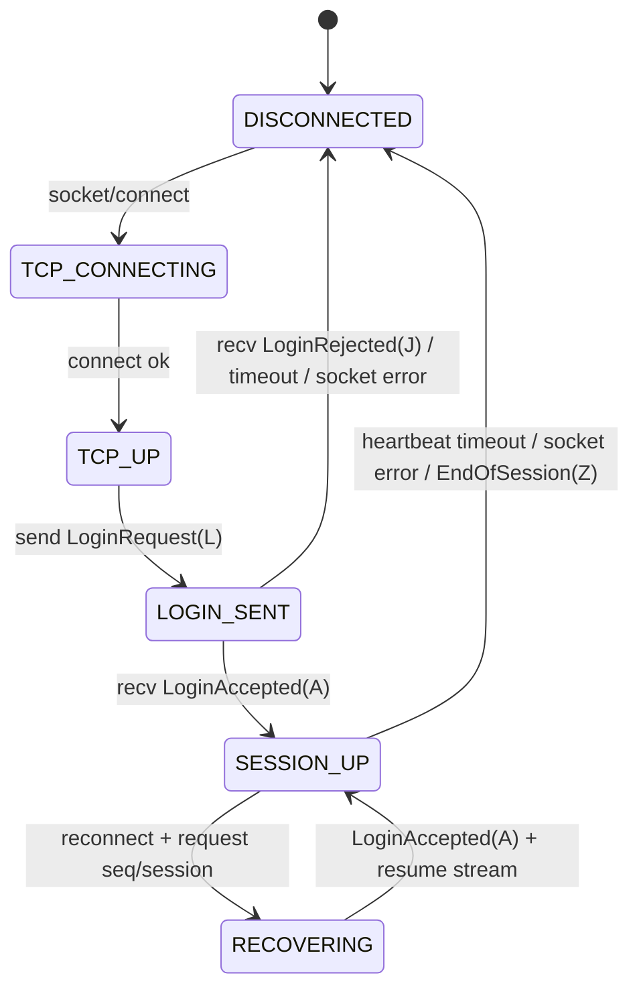
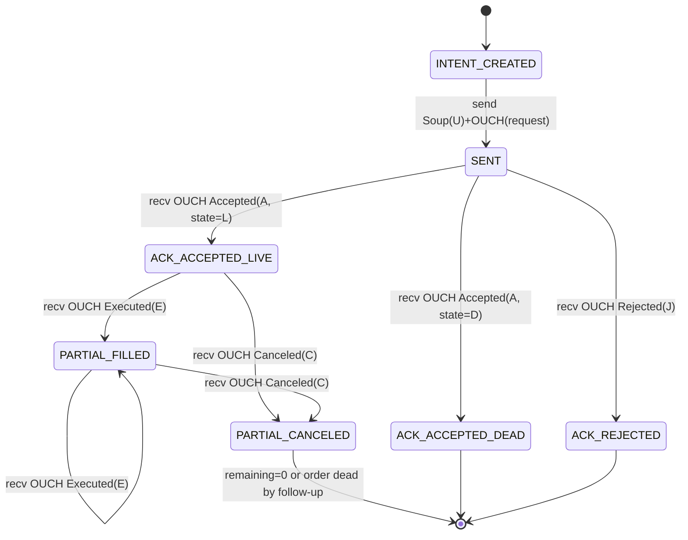

# Linux 内核 TCP 上的 Nasdaq OUCH + SoupBinTCP：HFT Tx 发送路径设计深度研究

## 执行摘要

在“仅用 Linux 内核 TCP（不做内核旁路）”的约束下，把 Nasdaq OUCH（订单入口协议）与常见的 SoupBinTCP（会话/传输层）做到**可预测的极低延迟 Tx 发送路径**，关键不在于追求某一个 API 的“最快”，而在于把 **OUC​​H 的端到端确认语义**（client→server 不保证送达、必须等待应用层回报）与 **SoupBinTCP 的恢复语义**（server→client 的序列化与断线续收）合并成一条可控的“责任链”。

OUCH 规范明确：  
- OUCH 是低层原生协议，追求最高性能；一般每类 OUCH 消息具有固定字段布局（并可带可选 appendage）；并且**host→client 的消息假定是有序且必须由下层协议保证送达与顺序**，典型下层协议就是 SoupBinTCP。citeturn6view0  
- 反过来，**client→host 的消息“本质上不保证送达”**（即便承载于 TCP），因此必须设计为“可以无害重发（benignly resent）”，并把“端到端确认（end-to-end acknowledgement）+ 无害重发”作为其容灾/镜像切换的基础能力。citeturn6view0turn6view1  

SoupBinTCP 规范同时强调：  
- server→client 有“Sequenced Data Packets”（无显式序号、靠双方计数序列），可在断线后通过“Session + Requested Sequence Number”续收；  
- client→server 通过 “Unsequenced Data Packet（type='U'）”发送，不做序列保证，断线时可能丢失；因此重要 client 消息必须由更高层协议提供确认（也就是 OUCH 的 Accepted/Rejected/Cancel 等回报）。citeturn6view2turn6view3turn9view3turn20view1turn9view1  

因此，本报告建议的总体 Tx path 组织方式是：

- 保留 **Connection / Sender / Receiver** 三模块职责划分（利于正确性与可测试性），但对于**极低延迟热路径**，采取“逻辑拆分、线程内合并”：让一个“会话 I/O 线程”同时驱动 Sender 与 Receiver，并让 Connection 的状态机在同线程内推进，尽量避免跨线程共享会话状态（特别是 UserRefNum、pending 列表、心跳与恢复点）。这样做的因果链清晰：**只有 I/O 线程能决定“是否真正发出/是否需要重发/是否已收到回报”**，从而把竞态面收敛到最小。citeturn6view1turn11view0turn22view0turn20view1  

在 API 层面，核心调用序列围绕：`socket()`/`connect()`/`setsockopt(TCP_NODELAY, SO_SNDBUF, SO_RCVBUF, SO_TIMESTAMPING, SO_BUSY_POLL, …)`、发送侧 `send()`/`sendmsg()`/`sendmmsg()`、接收侧 `recv()`/`recvmsg()`（解析 Soup 帧化），以及在需要“可证明的 Tx 时间戳”时通过 `SO_TIMESTAMPING + recvmsg(MSG_ERRQUEUE)`从错误队列取 Tx timestamps。citeturn19view0turn19view1turn18view1turn17view2turn3search1turn21view0  

对 “MSG_ZEROCOPY 是否适用” 的结论非常明确：就 OUCH 这种**几十字节到低百字节级别的小报文**而言，它通常不合算。内核文档指出 `MSG_ZEROCOPY` 一般只在写入量超过约 10KB 时才有效，并且需要 `setsockopt(SO_ZEROCOPY)` 预先声明意图、还要从错误队列消费 completion 通知，增加实现复杂度与潜在尾延迟来源。citeturn17view1turn11view0turn12search0  

## 未指定假设与目标

下列关键参数在问题中未给出，会显著改变最优线程模型与 buffer 策略；报告其余部分将显式标注“在这些假设下”的设计推导。

未指定假设（用于本文默认分析）：
- 连接数：1–4 条 OUCH 订单入口会话（主/备或多端口），每条会话独立 TCP 连接。citeturn6view0turn11view0  
- 峰值吞吐：单会话 10k–100k msg/s（实际常受交易所/网关限流与风控约束），报文以 Enter/Replace/Cancel 为主。citeturn6view1turn11view0turn22view1  
- 主目标：最小化“策略决策→系统调用入栈→网卡驱动层（可选：硬件 Tx 时间戳点）”的 p99/p99.9 尾延迟；允许用专用 CPU 核换取更低抖动。citeturn18view1turn3search2turn17view2  
- 系统：Linux，使用标准 socket API；允许配置 CPU 亲和性与少量 sysctl/setsockopt 调优，不使用 DPDK/Onload 等旁路。citeturn3search2turn18view1turn19view0  

## 总体架构与设计理由

### 问题与机会

问题在于：在 OUCH + SoupBinTCP 的语义下，**“写入 TCP socket 成功”不等价于“交易所收到并接受订单”**。SoupBinTCP 明确指出 client→server 消息不做序列化且在 TCP 故障时可能丢失；OUCH 也强调 client→host 消息“本质上不保证送达”，因此必须靠**端到端确认回报**与**无害重发**来闭环。citeturn6view2turn6view0turn6view1turn9view3  

机会在于：这些约束其实给了我们一个很工程化的“责任分界”——  
- SoupBinTCP 负责把 **server→client** 变成“可恢复的序列流”；  
- OUCH 负责把 **client→server** 变成“可无害重发、由回报确认的命令流”；  
只要 Tx path 把这两条流的状态机设计成“单写者、可重放、可观测”，就能在不做内核旁路的前提下把尾延迟压到主要由内核调度、socket buffer 与 NIC 队列决定的水平。citeturn20view1turn6view1turn11view0turn18view1  

### 架构概览与三模块落地方式

在 HFT 语境里，可以把三模块类比为一条“职责链”：

- **Connection（门禁/会话管理员）**：负责“连得上、登录成功、恢复点正确、心跳合规”。SoupBinTCP 登录流程、心跳要求与断线恢复方式都属于它的职责。citeturn9view2turn20view0turn9view1turn16view0  
- **Sender（交易助理/投递员）**：负责把策略意图变成 OUCH 二进制命令，并封装成 SoupBinTCP 的 client→server Unsequenced Data Packet；同时处理背压与“发送不确定性”。OUC​​H 对 UserRefNum 单调递增与“低于 last processed 视为重传”的规则，决定了 Sender 必须掌握 UserRefNum 分配与 pending 队列。citeturn6view0turn6view1turn11view0turn22view0  
- **Receiver（回执秘书/状态推进者）**：负责收取 SoupBinTCP server→client Sequenced Data Packets 与心跳，解析其中的 OUCH 回报（Accepted/Rejected/Canceled/Executed…），并据此确认、清理 pending、推进订单状态与故障恢复点。citeturn20view1turn11view0turn22view0turn11view2turn11view3  

在“极低延迟热路径”上，建议采用**线程内合并策略**：  
- Connection 状态机、Sender 编码/发送、Receiver 解析/回报处理都在同一个“会话 I/O 线程”里推进；  
- 策略线程通过 **SPSC/One-to-One ring** 把 OrderIntent 交给 I/O 线程；I/O 线程是会话状态（UserRefNum、Session、Soup sequence、心跳定时）唯一写者。类似的无争用 ring buffer 思路在 Disruptor 等低延迟并发模式文献中被反复证明能降低锁竞争与尾延迟。citeturn13search4turn6view1turn6view0  

## 模块职责与内核 TCP API 细节

### Connection 模块：socket/选项/连接/登录的调用序列

#### socket 与非阻塞方式选择

TCP 是字节流，**不保留记录边界**；这件事直接决定你必须做 SoupBinTCP 的 length-based 帧解析，而不能以 `recv()` 的一次返回作为“一个 Soup 包”。citeturn18view0turn3search1turn6view3  

是否把 socket 设为非阻塞，决定你后续的 I/O 驱动模型：  
- 使用 `socket(..., SOCK_STREAM | SOCK_NONBLOCK, ...)` 可在创建时直接得到非阻塞 fd，避免一次额外的 `fcntl(O_NONBLOCK)`。citeturn3search1turn3search0  
- 非阻塞下 `connect()` 往往会返回 `EINPROGRESS`，随后用 `poll/epoll` 等等待完成；这在 socket(7) 对非阻塞 I/O 的描述里被明确指出。citeturn3search0turn1search2turn1search32  

对“单会话专用 I/O 线程”而言，一个常见且低抖动的折中是：  
- socket 设为非阻塞；  
- 热路径中尽量直调用 `sendmsg/recvmsg`；  
- 仅当遇到 `EAGAIN`（背压/无数据）才进入 `epoll_wait` 或短暂 park。这样减少在“常态可读可写”时对 `epoll_wait` 的依赖，符合 epoll(7) 对 EPOLLET 的“读写到 EAGAIN”为止的建议。citeturn1search2turn19view0turn19view3  

#### setsockopt：低延迟与可观测性选项

Connection 在 `connect()` 前后通常会设置至少以下选项（不同内核版本与 NIC 能力会影响有效性）：

- `TCP_NODELAY`：禁用 Nagle，以降低小包发送延迟；实时/低延迟调优指南明确建议低延迟应用打开。citeturn3search20turn19view0  
- `SO_SNDBUF` / `SO_RCVBUF`：控制 socket send/recv buffer 上限。socket(7) 与 tcp(7) 都指出：内核会把设置值**加倍**用于 bookkeeping，并受 `/proc/sys/net/core/wmem_max` 等上限约束；并且要在 `connect()` 前设置才一定生效。citeturn18view1turn18view0  
- `SO_BUSY_POLL`（可选）：socket(7) 说明它用于“在阻塞接收且无数据时 busy poll 若干微秒”，可能改善延迟但增加 CPU/功耗；对少量 socket 的建议值常见在几十微秒量级。citeturn18view1turn3search6  
- `SO_TIMESTAMPING`（测量用，非生产热路径默认）：用于 Rx/Tx 时间戳。内核文档指出 Tx 时间戳会通过**错误队列**回送并需用 `recvmsg(MSG_ERRQUEUE)`读取。citeturn17view2turn0search3turn12search7  
- `SO_ZEROCOPY`（仅当准备使用 `MSG_ZEROCOPY`）：内核文档明确，需要先 `setsockopt(..., SO_ZEROCOPY, ...)` 表示意图，随后发送调用再带 `MSG_ZEROCOPY`。citeturn17view1turn17view0  

#### SoupBinTCP 登录握手

SoupBinTCP 规定：连接开始后 client 发送 Login Request（type='L'），server 若接受则返回 Login Accepted（type='A'）并开始发送 Sequenced/Unsequenced data；若拒绝则返回 Login Rejected（type='J'）并关闭连接。citeturn6view3turn20view0turn20view1  

Login Request 的字段布局（用户名/密码/Session/Requested Sequence Number）与“server 若在合理时间内收不到 Login Request 可终止 socket”也在规范中给出。citeturn9view3turn9view2turn9view3  

并且 Login Accepted 包含：Session ID 与“下一条 Sequenced 消息的序号（ASCII）”，这是你恢复 server→client 序列流的锚点。citeturn20view0turn6view3turn20view1  

### Sender 模块：OUCH 编码、Soup 封装、send* 选择与背压

#### OUCH 消息的“无害重发”前提：UserRefNum 的单调分配与 pending 追踪

OUCH 关键规则之一是：对一个 OUCH port，UserRefNum 用作 transaction identifier，必须**日内唯一且严格递增**；系统会忽略小于 last processed 的新订单请求，把它当作重传。citeturn6view0turn6view1  

同时 OUCH 明确：client→host 消息不保证送达，“无害重发 + 端到端确认”是其故障切换的基础；连接失败时你无法确定 pending 消息是否已到达，因此 robust client 可以在镜像链路上重发 pending 消息而不担心制造重复。citeturn6view0turn6view1  

这直接推导出 Sender 的两个不可替代职责：  
1) **分配 UserRefNum**（单调递增，必要时使用 UserRefIdx 做多通道分摊）；  
2) **维护 pending 表**（至少记录：UserRefNum → 原始 OUCH 请求字节串/语义、首次发送时间、重发次数、是否已被回报确认）。citeturn6view0turn6view1turn11view0turn22view0  

对 pending 的确认策略应完全基于 OUCH 回报：例如 Enter Order 的“端到端 ack”通常表现为 Order Accepted（type='A'）或 Rejected（type='J'），而不是 `send()` 成功。OUCH 对 Accepted 的定义就是“确认收到并接受有效的 Enter Order”，并指出顺序关系（通常先 Accepted，再 Executed/Canceled）。citeturn11view0turn22view0  

Rejected 还特别指出：Rejected 消息对应的 Order UserRefNum **不能复用**。这意味着“无害重发”也必须遵守：重发可以用同一个 UserRefNum，但绝不能把被拒的 UserRefNum 用于新订单。citeturn22view0turn6view0  

#### OUCH 定长二进制编码示例：Enter Order 固定部分

OUCH 文档在架构与数据类型部分强调：数值字段是二进制大端（big-endian），并列出 Long/Integer/Short/Byte 等数值类型；这对编码实现意味着你要显式做端序转换（例如 `htobe32/htobe64`）。citeturn6view0turn6view1  

Enter Order（type='O'）表格展示了前若干字段的 offset/length（UserRefNum 4 字节，Side 1 字节，Quantity 4 字节，Symbol 8 字节，Price 8 字节等），足以说明其固定部分是“几十字节级别”的紧凑二进制布局。citeturn6view1turn6view0  

一个面向 Tx 热路径的实现要点是：  
- 用预分配的 `uint8_t buf[]` 原地写字段；  
- 避免临时对象与堆分配；  
- 对齐与 padding 策略要与协议字段一致（alpha 字段右侧空格填充等）。citeturn6view0turn23search0  

#### SoupBinTCP 帧化：把 OUCH 命令装入 Unsequenced Data Packet

SoupBinTCP 逻辑包结构是：2 字节 big-endian 长度（长度=payload+type，type 长度为 1）+ 1 字节 packet type + 可变 payload；并且明确指出逻辑包不一定与 TCP 物理分段对应，可能被拆分或聚合。citeturn6view2turn6view3turn9view1  

对 client→server 下单而言，规范指出 client 可在登录后任意时刻用 Unsequenced Data Packets 发送消息（packet type='U'），且这些消息可能在 socket 故障时丢失，需要上层协议处理丢失语义。citeturn6view3turn9view3turn9view1  

因此 Tx 热路径的最小封装就是：`Soup(U) + OUCH(O/U/X/...)`。其因果关系非常直接：  
- **如果 Soup “U 包”没到达交易所**，交易所就不会生成 OUCH 回报；  
- **如果到达但你没收到回报**（例如断线），根据 OUCH 的 benign resend 设计，你必须重发 pending，直到看到对应的 Accepted/Rejected/Canceled 等回报确认。citeturn6view1turn11view0turn22view0turn9view3  

#### send / sendmsg / sendmmsg：系统调用最小化与延迟权衡

在内核 TCP 下，发送 API 的选择本质是：**用更少 syscalls 换取更少开销**，但必须显式处理背压与部分发送。

- `send()`/`sendmsg()`：当数据不适配 send buffer，默认会阻塞；非阻塞模式则返回 `EAGAIN/EWOULDBLOCK`。这正是你在 Sender 中向上游传播背压的“硬信号”。citeturn19view0turn18view1  
- `MSG_DONTWAIT` 允许以“每次调用非阻塞”的方式获得类似 O_NONBLOCK 的效果，且是 per-call 选项。citeturn19view0turn3search0  
- `sendmmsg()` 明确被定义为 `sendmsg()` 的扩展：一次系统调用发送多条消息，在一些应用中有性能收益；并且它会返回“成功发送的消息条数”。citeturn19view1turn19view0  

对 HFT 下单而言，`sendmmsg()` 的关键价值在于：当你在一个 I/O loop 中**自然积累了多条要发的 OUCH 命令**（例如策略 burst、或同一轮风控/撤单批量），你可以把若干条 Soup 帧一次性入内核，减少 syscall频次。

但它也带来两个必须正视的工程后果：  
1) **批量意味着你要在用户态“等到凑够若干条或到达时间窗口”**才调用 `sendmmsg()`，这会把等待窗口直接加到单笔延迟上（上界就是你选择的等待策略）；  
2) sendmmsg(2) 的 BUGS 段落指出：若在至少一条消息发送后发生错误，调用会返回已发送条数并“丢失错误码”，使得“哪一条失败/是否需要重发”的判断更依赖应用层回报闭环。对 OUCH 而言，这反而可接受，因为体系设计本就要求 benign resend + 回报确认。citeturn19view1turn6view1  

### Receiver 模块：Soup 帧解析、OUCH 回报处理、错误队列（时间戳/零拷贝通知）

#### 主接收路径：字节流 → Soup 帧 → OUCH 消息

实现上，Receiver 必须同时满足三个事实：  
- TCP 不保留记录边界；citeturn18view0turn3search1  
- Soup 逻辑包可能被 TCP 拆分或聚合；citeturn6view3turn9view1  
- Soup 的每个 Sequenced Data Packet 携带“一条上层协议消息”（对于 OUCH，就是一条 OUCH 回报）。citeturn6view3turn20view1  

因此常见做法是：维护一个可增长但有上界的 ring/linear buffer，循环执行：  
1) 从 socket `recv()` 到 buffer 尾部；  
2) 若 buffer≥2 字节，解析 length；若 buffer≥(2+length) 则提取完整 Soup 包；  
3) 根据 Soup packet type 分派：  
   - 'S' → Sequenced：更新本地序号计数、解析 payload 为 OUCH 回报；  
   - 'H'/'Z'/'+' → 心跳/结束/调试等；  
4) 不完整则继续读。citeturn6view2turn6view3turn9view1turn9view2turn9view1  

#### OUCH 回报对 Tx 的反馈闭环：Accepted/Rejected/Canceled/Executed 等

以最关键的 Enter Order 为例：  
- Order Accepted（type='A'）定义为“确认收到并接受有效的 Enter Order”，并说明它通常先于 Executed/Canceled；还引入 Order State（Live/Dead），Dead 表示“被接受但自动取消”，之后不会再收到该订单的消息。citeturn11view0turn10view0  
- Rejected（type='J'）可作为对 Enter/Replace 的拒绝回报，并明确其 UserRefNum 不可复用。citeturn22view0turn21view0  
- Canceled（type='C'）说明订单被减少或取消，数量字段是增量而非累计，并强调 canceled 不一定代表订单完全死亡。citeturn11view2turn10view3  
- Executed（type='E'）说明部分或全部成交，Quantity 同样是增量。citeturn11view3turn10view3  

对 Tx path 的“确认策略”应当按 OUCH 回报类型建模为状态机（详见下一节），并将这些回报事件作为：  
- pending 条目的确认/终结条件；  
- 重发/超时的停止条件；  
- 断线后“订单状态不确定”的对账输入。citeturn11view0turn22view0turn11view3turn11view2  

#### SO_TIMESTAMPING 与 MSG_ERRQUEUE：把“策略→wire”测成可验证数据

Linux 内核文档（中文译文）对 transmit timestamping 给出非常具体的机制描述：  
- Tx 时间戳会把“传出数据包回环到套接字错误队列”，进程用 `recvmsg(MSG_ERRQUEUE)`读取；同时会带一个 `IP_RECVERR`（含 `sock_extended_err`）与一个 `SCM_TIMESTAMPING` 控制消息。citeturn17view2turn18view1  
- 从错误队列读取**永远是非阻塞**；要阻塞等待时间戳应使用 `poll/select`，并通过 `POLLERR` 得知错误队列有数据。citeturn17view2turn18view1  
- 错误队列中的 payload 在你读取前会占用 `SO_RCVBUF` 预算；因此如果你开启 Tx timestamps，却不及时 drain error queue，会引入内存与延迟的副作用。citeturn17view2turn18view1  

这使得一种实战测量模式非常自然：  
- 生产环境默认关闭 Tx timestamping（避免额外 error-queue 处理）；  
- 性能验证/回归压测时打开 `SO_TIMESTAMPING`，配合 “策略侧打点 + 内核 Tx timestamp + NIC PHC 对齐” 得到更接近 wire 的时间。citeturn17view2turn4search2turn4search6  

## SOUP+OUCH 会话与状态机

### SoupBinTCP 会话状态机骨架

SoupBinTCP 的恢复关键点在于：  
- Sequenced data 不含显式序号，序号靠计数；  
- 断线重连可在 Login Request 中携带 “Requested Session + Requested Sequence Number” 续收；  
- Login Accepted 会返回 Session 与“下一条 Sequenced 消息序号（ASCII）”。citeturn20view1turn20view0turn9view3turn9view1  

一个足够贴近规范且利于故障恢复的状态机可写成：



其中“心跳超时”遵循 SoupBinTCP 的双向心跳规则：server 超过 1 秒无数据需发 Server Heartbeat（type='H'），client 超过 1 秒无发送需发 Client Heartbeat（type='R'）；若长时间收不到对端数据/心跳，可假定链路断并重连。citeturn9view1turn16view0turn15view1  

### OUCH 订单生命周期状态机骨架与确认策略

OUCH 把“端到端确认”做到了协议回报里。以 UserRefNum 为主键，可用下列状态机驱动 Tx 侧 pending 与超时/重发逻辑：



关键协议约束对设计的影响如下：

- **UserRefNum 单调递增与“低于 last processed 视为重传”**：  
  这使得“重发 pending”在协议上天然安全，但要求 Sender 在任何故障恢复中都不能把 UserRefNum 回滚，也不能把 Rejected 的 UserRefNum 复用于新订单。citeturn6view0turn6view1turn22view0  

- **Cancel Pending / Cancel Reject 的“仅发送一次 + 重复请求会被忽略”**：  
  这意味着取消链路同样要用“回报确认”而不是“重复 cancel flood”。策略侧如果需要确认 cancel 已进入交易所处理流程，应等待 Cancel Pending 或 Canceled 等回报，而不是不加控制地重发。citeturn22view0turn22view1  

- **镜像/容灾的语义**：  
  OUCH 描述了“一个 OUCH Account 可绑定多个物理 OUCH 机器作为镜像冗余”，且 outbound 消息可由两台物理 host 同时生成。这要求你在做双连接容灾时明确：是“热备但只消费一侧回报”，还是“双收回报并做去重/一致性”。否则双收会把 Rx path 的重复事件直接放大到策略/风控层。citeturn6view0turn6view1  

## 线程模型与性能优化选项

### 线程模型选择的因果链

在“内核 TCP，不旁路”的前提下，决定尾延迟的大头通常来自：  
- 调度唤醒与核间迁移（缓存冷、NUMA 远程访问）；  
- socket buffer 堵塞导致的背压与排队；  
- 解析/编码与跨线程同步导致的 cacheline ping-pong。citeturn18view1turn3search2turn13search4  

所以线程模型的核心目标是：**把会话状态的写者收敛、把跨核通信做成单向无争用、让 I/O 线程尽量“总在位”**。

CPU pinning 的系统调用基础也很明确：  
- `sched_setaffinity(2)`/`pthread_setaffinity_np(3)` 可将线程绑定到指定 CPU 集合，若线程不在集合内运行会被迁移过去。citeturn3search2turn3search5  

策略→I/O 的交接推荐采用 SPSC ring（比如 Disruptor/Agrona 风格），其共同特征是：预分配、无锁、依赖内存屏障/原子序来避免锁竞争，从而降低尾延迟。citeturn13search4turn13search1  

### 选项比较表

评分采用 1–5（5=更优），并在“解释”列给出为什么（延迟的主要因果链）。这些选项并非互斥，但表格按“作为主导设计点”来比较。

| 选项（主导模式/技术） | 延迟（p99 潜力） | 吞吐 | 复杂度 | 资源消耗 | 解释（为何快/为何慢） |
|---|---:|---:|---:|---:|---|
| 单会话单 I/O 线程（Tx+Rx 同线程，模块线程内合并） | 5 | 4 | 3 | 4 | 单写者推进 Soup/OUCH 状态，避免跨线程共享；配合 affinity 抑制抖动。citeturn6view1turn3search2turn20view1 |
| Sender/Receiver 分离（两线程，共享会话状态） | 4 | 4 | 5 | 2 | 可把 Rx 长时间等待/心跳处理从 Tx 中隔离，但必须同步 pending/定时器/序号，易造成 cacheline 争用与复杂故障。citeturn22view0turn13search4 |
| epoll reactor（集中 poll，多连接复用） | 3 | 5 | 3 | 5 | 连接数多时资源最省；但尾延迟更依赖调度与事件唤醒；EPOLLET 必须读写到 EAGAIN，否则易出“假死”。citeturn1search2turn3search0turn19view3 |
| io_uring reactor（完成驱动） | 3 | 5 | 4 | 4 | io_uring 提供共享环与完成队列；对网络 I/O 是否降延迟取决于内核版本与用法，通常需要严格 A/B 测试。citeturn1search31turn1search3 |
| sendmmsg 批量发送（micro-batch） | 2–4 | 5 | 3 | 5 | 单次 syscall 发送多条，降低 syscall 频次；但如果为凑批引入等待窗口，会直接增加单笔延迟上界；且错误处理存在“部分成功但丢失错误码”的现实。citeturn19view1turn6view1 |
| MSG_ZEROCOPY（含 SO_ZEROCOPY + error queue 通知） | 1（对 OUCH） | 3 | 5 | 3 | 文档指出通常仅对 >10KB 写入有效；OUCH 报文固定部分通常几十字节级别，收益小且增加 error queue 处理与语义复杂度。citeturn17view1turn11view0turn6view1 |

### 背压与 socket buffer 管理：把“EAGAIN”变成可控机制

背压是内核 TCP 的事实：当消息放不进 send buffer，非阻塞发送会返回 `EAGAIN/EWOULDBLOCK`。citeturn19view0turn18view1  

因此你的 Tx path 必须有明确的“背压策略”，典型可控做法是：

- Sender 维护有界 software queue（pending 之外的“尚未尝试发送队列”），超过上界时触发策略降载（例如仅允许 cancel、拒绝新开仓），而不是无限堆积。该策略本身是系统设计推导，但背压信号与行为边界来自 send(2) 语义。citeturn19view0turn11view2turn22view1  
- 合理设置 `SO_SNDBUF`/`SO_RCVBUF`，并理解“设置值会被内核加倍且受 wmem_max/rmem_max 限制”。这直接影响：背压出现频率（buffer 太小）与排队时延（buffer 太大，积压更多未发数据）。citeturn18view1turn18view0  
- 评估 `SO_BUSY_POLL`：它只在“阻塞接收且无数据”时忙轮询指定微秒数，可能降低 Rx 唤醒延迟，但会增加 CPU 与功耗。citeturn18view1turn3search6  

## 延迟测量与微基准验证

### 最小 API（伪代码）与线程内合并骨架

下面给出一个“策略线程 + 会话 I/O 线程”的最小骨架，强调：  
- 策略线程只生成意图，不写 UserRefNum；  
- I/O 线程单写者推进 UserRefNum、Soup session 与 OUCH pending；  
- 需要度量时可额外开启 timestamping/error-queue 读取。

```c
// Strategy -> IO: SPSC ring
bool txq_push(OrderIntent oi);

// IO -> Strategy: SPSC ring
int  rxq_pop(RxEvent* out, int max);

// Connection
int  conn_open();              // socket/connect + setsockopt
int  soup_login();             // send 'L', wait 'A' or 'J'

// Sender (in IO thread)
SendResult ouch_send_intent(const OrderIntent* oi); // alloc UserRefNum, build OUCH msg, wrap Soup 'U', send

// Receiver (in IO thread)
int  poll_socket_and_parse();  // recv bytes, parse Soup frames, emit RxEvent, update pending

// Optional measurement
int  drain_errqueue_timestamps(); // recvmsg(MSG_ERRQUEUE) when SO_TIMESTAMPING enabled
```

以上骨架依赖的系统语义包括：TCP 字节流无记录边界、send 在非阻塞下的 EAGAIN 行为、以及 Tx 时间戳通过错误队列回送并用 `recvmsg(MSG_ERRQUEUE)`获取。citeturn18view0turn19view0turn17view2  

### OUCH+SoupBinTCP 的订单生命周期 Tx 时序图示例

```mermaid
sequenceDiagram
  participant Strat as Strategy (决策线程)
  participant TxQ as SPSC TxRing
  participant IO as Session IO Thread (Conn+Sender+Receiver)
  participant K as Linux TCP Socket/Kernel
  participant Ex as Exchange Gateway
  participant RxQ as SPSC RxRing

  Strat->>Strat: 生成 OrderIntent(symbol, side, px, qty, clOrdId)
  Strat->>TxQ: push(OrderIntent)

  IO->>TxQ: pop()
  IO->>IO: 分配 UserRefNum(严格递增) + 记录pending
  IO->>IO: 编码 OUCH 请求 (二进制大端)
  IO->>IO: 封装 SoupBinTCP UnseqData('U') 帧(2B len + 1B type + payload)
  IO->>K: send/sendmsg/sendmmsg (nonblock; handle EAGAIN)
  K->>Ex: TCP bytes on wire

  Ex-->>K: Soup SequencedData('S') carrying OUCH replies (A/J/C/E...)
  K-->>IO: recv bytes
  IO->>IO: 解析 Soup 帧 + 计数 sequenced 序号 + 解码 OUCH 回报
  IO->>RxQ: push(RxEvent: Accepted/Rejected/Canceled/Executed)

  Strat->>RxQ: pop(RxEvent)
  Strat->>Strat: 更新订单状态/仓位/策略
```

该时序图与协议事实一致：client→server 通过 Soup Unsequenced Data Packet 发送且可能丢失，必须靠 OUCH 回报实现端到端确认；server→client 通过 Soup Sequenced Data Packets 保证顺序并可断线续收。citeturn9view3turn6view1turn20view1turn11view0turn22view0  

### 微基准与测量步骤：从“策略到 wire”的可重复方法

#### 分层测量点设计

建议将延迟拆成三个可测层次（每层都有明确的因果解释）：

- **L0：纯用户态（不入内核）**  
  - 订单意图对象构造、风险检查（若有）、SPSC ring push/pop、OUCH 编码（含端序转换）  
  - 目标：确定你是否在热路径引入了堆分配/锁竞争。hffix 等低延迟库强调“在 I/O buffer 原地编码/解码、无堆分配”的方向，可作为编码层实现风格的参照。citeturn23search0  

- **L1：用户态→内核边界（syscall）**  
  - 以 `sendmsg/sendmmsg` 调用点周围的时间戳衡量“提交到内核”开销，并统计 `EAGAIN` 频率（背压）。send(2) 文档明确 nonblocking 时 `EAGAIN/EWOULDBLOCK` 的语义边界。citeturn19view0turn18view1  

- **L2：接近 wire 的时间（推荐用 SO_TIMESTAMPING）**  
  - 开启 `SO_TIMESTAMPING`，从错误队列读取 Tx 时间戳。内核中文文档明确 Tx timestamp 的获取方式（MSG_ERRQUEUE + SCM_TIMESTAMPING + IP_RECVERR）。citeturn17view2turn18view1  

#### 与 PHC 对齐：让时间戳“可比、可证明”

若你要把 Tx timestamps 与其他系统（行情、撮合回报）做纳秒级对齐，通常需要 NIC 的 PTP Hardware Clock（PHC）与系统时钟同步。linuxptp 工具链中 `phc2sys` 的文档说明：它常用于把系统时钟同步到 PHC，而 PHC 自身可由 `ptp4l` 同步到主时钟。citeturn4search2turn4search6  

在开始前，先确认 NIC 是否支持硬件时间戳与对应 PHC index；`ETHTOOL_GET_TS_INFO`/`ethtool -T` 的能力查询流程在相关文档里被清晰描述。citeturn4search1turn4search9  

#### 内核 trace 点：定位“尾延迟来自哪里”

当你看到 p99.9 抖动时，通常需要从内核侧定位：到底是调度、软中断、队列积压还是错误队列处理导致。ftrace 是内核官方的 tracer 框架之一，定位内核时延问题时常用。citeturn12search11turn12search32  

（此处给出方法论：实际 trace 配置会依赖你的内核版本与权限模型。）

## 结论与推荐配置

### 推荐的总体方案

在“内核 TCP、不旁路、少量会话、追求尾延迟”这一组默认假设下，最稳健的 Tx path 组合是：

- 采用 **Connection/Sender/Receiver 的职责拆分**，但在热路径上 **线程内合并**（单会话单 I/O 线程驱动三者），避免跨线程共享会话状态与 pending 表。其合理性来自协议约束：UserRefNum 单调分配 + benign resend + 回报确认，需要一个单写者顺序推进。citeturn6view1turn22view0turn11view0turn20view1  
- 策略→I/O 交接用 **SPSC ring**，预分配、无锁、减少争用；这是低延迟系统中反复出现的共识模式。citeturn13search4turn13search1  
- socket 选项至少：`TCP_NODELAY` + 合理 `SO_SNDBUF/SO_RCVBUF`；是否使用 `SO_BUSY_POLL` 取决于你是否愿意用 CPU 换更低 Rx 唤醒延迟。citeturn3search20turn18view1turn3search6  
- 发送 API 默认用 `sendmsg()`（便于 iovec 封装 “Soup header + OUCH payload”），在确认“确有批量且可接受微小等待窗口”时再引入 `sendmmsg()` micro-batch；并把 sendmmsg 的“部分成功但错误码可能丢失”纳入恢复策略（靠 OUCH benign resend + 回报确认闭环）。citeturn19view1turn6view1turn11view0  
- 不建议把 `MSG_ZEROCOPY` 用在 OUCH 下单热路径：其文档阈值（约 10KB）与 error-queue completion 复杂度，使其更适用于大块数据发送而非几十字节级别命令流。citeturn17view1turn11view0turn6view1  

### 开源/商用参考实现的定位方式

你在实现 OUCH+SoupBinTCP 的内核 TCP Tx path 时，可按“取其结构，不照搬其协议”的方式参考这些项目的设计点：

- libtrading：自述支持包括 ITCH、OUCH 在内的多种交易所协议，定位为高性能低延迟交易连接库，可借鉴其协议解析与工程组织方式。citeturn14search4  
- OUCH_5.0_C_lib：一个面向 OUCH 5.0 的 C 语言消息解析库示例，可用于学习“字段生成/编解码”组织方式，但需自行评估其性能与正确性保障。citeturn0search20  
- SoupBinTCP 的多语言实现（例如 SoupBinTCP.NET）：可用于核对帧化与登录/心跳细节实现。citeturn14search1turn16view0  
- QuickFIX / Artio / hffix（FIX 生态）：虽然不是 OUCH，但它们在“会话状态机、重连、心跳、序号、零分配编码”等工程问题上提供大量可迁移经验；尤其 hffix 强调在 I/O buffer 原地编码解码且无堆分配，与 HFT 热路径思维一致。citeturn23search0turn23search3turn23search18  

最终落地时，建议把“协议正确性回归测试”（按 OUCH/Soup 规范构造断线/重连/重发/重复回报等场景）与“微基准/尾延迟回归”（SO_TIMESTAMPING/PHC/trace）一起纳入 CI/CD，否则很容易在一次“看似无害的优化”中引入灾难性的恢复漏洞。citeturn6view1turn17view2turn19view1turn20view1