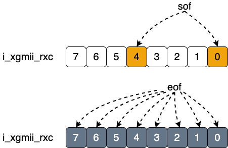
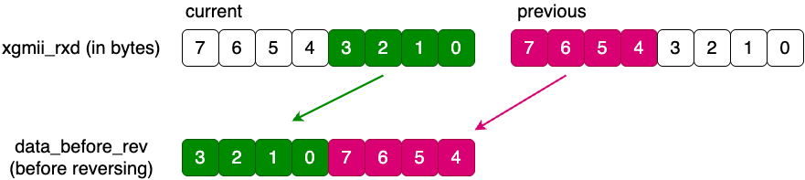

# MAC_layer_rx
`MAC_layer_rx` converts a 64-bit XGMII receive stream into a simplified AXI-Stream style interface for the parser pipeline. The implementation lives in `verilog_src/MAC_layer/MAC_layer_rx.v`.

## Role
Convert incomming (rx) xgmii signal into AXI interface.
## Interface
### Inputs
- `i_xgmii_rx_clk` is the receive clock for the whole module.
- `i_xgmii_rx_rst` is an active-high reset that clears the current frame state.
- `i_xgmii_rxd` and `i_xgmii_rxc` carry one 64-bit XGMII beat plus 8 control bits.
- `i_rx_status` is treated as link health; if it drops, the module flushes its internal state.
- `i_axi_rx_ready` is **not true backpressure**. If the downstream is not ready, the current frame is dropped because XGMII itself cannot stall.
### Outputs
- `o_axi_rx_data`, `o_axi_rx_valid`, `o_axi_rx_keep`, and `o_axi_rx_last` form the downstream receive stream.
- `o_frame_start` pulses when a new frame is accepted; `Top.v` uses it to timestamp ingress.
## Start and End Detection
1. **Start indication** can only be at zeroth or fourth place (from left) in `i_xgmii_rxc`.
2. **End indication** can be any bit in `i_xgmii_rxc`.
3. They are using **combinational logic**, so once there is valid bit in `i_xgmii_rxc`, the corresponding sof or eof bit will be asserted at the same time.
```verilog
    genvar      idx;
    generate
        for (idx = 0; idx < 2; idx = idx + 1 ) begin:sof_check
            assign sof_location [idx] = i_xgmii_rxc[idx*4] && (i_xgmii_rxd[idx*32 +:8] == XGMII_START);
        end
    endgenerate
    generate
        for (idx = 0; idx < 8; idx = idx + 1 ) begin:eof_check
            assign eof_location [idx] = i_xgmii_rxc[idx] && (i_xgmii_rxd[idx*8 +:8] == XGMII_TERM);
        end
    endgenerate
```
`sof_location[0]` means the frame starts in byte 0 of the current word. `sof_location[1]` means the frame starts in byte 4, so the payload must be stitched across two cycles.
Below is the illustration of possible sof and eof location in xgmii_rxc.



## State Machine
There are three states in `cur_state`

- `IDLE`: 
    1. waiting for start of the frame. Once any of `sof_location` bit is true (|sof_location), it changes to `SOF` state.
    2. Assert `o_frame_start`. This is used to start `time_stamp`.
- `SOF`:
 
    1. It means the start of the frame, as well as frame transmitting.
    2. `valid_d1` will be asserted, which is the indication of the payload. As it is a register, there is one cycle  latency for it to be true asserted. This is done on purpose which is used to discard the **preamble and SFD** .
    3. It checks `|eof_location`, which is an indication of end of the frame.
    4. It assign `eof_location` to `eof_reg`. This is used for the proper `last` and `keep` signal in **AXI channel**.

- `TERM`: 
    1. desert `valid_1`.
    2. return to `IDLE`.

## `o_axi_rx_valid` signal
1. **Assertion**

    When `cur_state` is `SOF`. directly assign `valid_d1` to it. 

2. **De-assertion**

    It depends on sof and eof. Even when `cur_state` is `EOF`, it does not mean we can de-assert it. Some combination of sof and eof can make `o_axi_rx_valid` last for one more cycle.

## Data Parsing
1. **if `sof_reg` is `2'b00`**

    It means no data.

2. **if `sof_reg` is `2'b01`**

    It means the data is always `i_xgmii_rxd_1`

3. **if `sof_reg` is `2'b10`**

    It means the when we detecting the sof, half of the data is already there. Thus, we should make a stitch like `{current_rxd,previous_rxd}`, where previous_rxd is `data_saver`. Below shows how data is stitched.



## `o_axi_rx_last` signal
It depends on `cur_state`, `sof_reg` and `eof_reg`.
To be honest, it should not be asserted in the first few cycles in practice, as there is always a minimal length for an Ethernet frame. I made the assertion of it possible in `SOF` just to align with the algorithm.
Just keep in mind that depending on combination of `sof_reg` and `eof_reg`, the last signal can be asserted at `TERM` or before `TERM`, as there is nothing left for transmit.

## `o_axi_rx_keep` signal
Here we used enumination, to list all the possible combination. A simple math can manage.

## Design Limits
- **No CRC check**: bad FCS is not detected here.
- **CRC is preserved**: downstream logic must ignore or strip it if needed.
- **No buffering on stall**: `!i_axi_rx_ready` resets the receive state and abandons the current frame.
- **64-bit specific**: the logic assumes `DATA_WIDTH=64` and `CTRL_WIDTH=8`, even though they are written as parameters.
