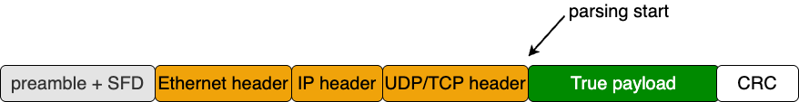

# order_book_parser
Parse Ethernet/IPv4/UDP payload data into a compact event interface. The module first walks fixed packet headers, then peeks message count and message type, and finally extracts fields such as `stock_locate`, `order_ref_num`, `shares`, and `price`.

## Design Logic

### The header

Before pasing the messages, we have to deal with Ethernet head, IP header and UDP/TCP header (The preabmle+SFD has already been filtered out in MAC layer), as illustrated below:



The lengths of headers are always fixed. The parsing of them is easy. We use a **counter** (`head_counter`) to indicate the end of headers.

### The messages

For each message, parsing is not finised until we get the end from `i_axi_rx_data`. Thus, we have to wait. However, The end of the previous message and the start of the next message may be mixed in `i_axi_rx_data`. So, we need another **counter** (`buffed_bytes`).

### States
In the big picture, the parsing can be divided into two phases:

1. **header parsing**.
2. **message parsing**.

The end of header parsing is indicated by `head_counter`, in the phase of **message parsing**, we have the following sub-states:

1. `IDLE`
2. `PEEKING_MSG_COUNT`
   - Get the total message count, used to indicate the end of parsing. It will be only entered once per frame.
3. `PEEKING_TYPE`
   - Peek the type of current message. The type will be sent at the begining of each message, we get the type, then we know how to parse.
4. `PARSING_BODY`
   - Case blocks, parse message according to the type. Jump back to `PEEKING_TYPE` if the parsing of the current message is over.
5. `ERROR`
   - If the type is no

## Interface
### Inputs
- `i_clk_156` is the parser clock.
- `i_rst` clears the header parser, message parser, and output registers.
- `i_axi_rx_data`, `i_axi_rx_valid`, `i_axi_rx_keep`, `i_axi_rx_last`, and `i_axi_rx_ingress_tick` come from `MAC_layer_rx`.
- `i_ctl_dst_mac`, `i_ctl_dst_ip`, `i_ctl_dst_port`, `i_promiscuous`, `i_sync_fire`, and `i_ctl_reg` program the parser settings registers.
### Outputs
- `o_axi_rx_ready` is tied high, so this block always accepts incoming beats.
- `o_msg_valid` pulses when one complete message has been decoded.
- `o_seq_num` and `o_rx_ingress_tick` carry packet-level context.
- `o_msg_type`, `o_stock_locate`, `o_order_ref_num`, `o_new_order_ref_num`, `o_buy_sell`, `o_shares`, `o_price`, and `o_timestamp` carry the parsed order-book fields.

## Settings Synchronization
The parser stores programmable defaults for destination MAC, destination IP, destination port, and promiscuous mode. `i_sync_fire` updates one register at a time according to `i_ctl_reg`.
```verilog
case (i_ctl_reg)
    16'h04: preset_dst_mac_addr <= i_ctl_dst_mac;
    16'h08: preset_dst_ip_addr  <= i_ctl_dst_ip;
    16'h0C: preset_dst_port     <= i_ctl_dst_port;
    16'h10: promiscuous         <= i_promiscuous;
endcase
```
In the current RTL these settings are **latched but not yet used** to accept or reject packets.

## Header Parsing
`head_counter` walks the first packet beats and captures fixed metadata before body parsing starts.
1. Beat 0 saves `o_rx_ingress_tick` and the destination MAC.
2. Beats 1 to 4 capture EtherType, IPv4 total length, protocol, destination IP, and UDP destination port.
3. Beats 5 to 7 capture the MoldUDP64 session and sequence number.
Once `head_counter == 6`, the message parser leaves `IDLE` and starts peeking the MoldUDP message count.

## Sliding Buffer
The module keeps a 512-bit history window so fields can cross AXI beat boundaries without special cases.
```verilog
reg  [511:0] prev_buff;
wire [511:0] cur_buff = {prev_buff[447:0], i_axi_rx_data};
wire [6:0] valid_bytes = buffed_bytes < 7'd6 ? 7'd0 : buffed_bytes - 7'd6;
```
`prev_buff` is sequential state. `cur_buff` mixes the previous window with the current beat, which lets the parser read the next field one cycle earlier. `valid_bytes` accounts for the fixed 6-byte gap between the current parse boundary and the start of the valid window.

## State Machine
The body parser is a 5-state machine.

- `IDLE`:
    1. Clear parser-local state such as `prev_buff`, `o_msg_valid`, `buffed_bytes`, `o_msg_type`, and `msg_count`.
    2. Wait until `head_counter == 6`, then move to `PEEKING_MSG_COUNT`.

- `PEEKING_MSG_COUNT`:
    1. Wait for `i_axi_rx_valid`.
    2. Latch the packet message count from `i_axi_rx_data[31:16]`.
    3. Shift the current AXI beat into `prev_buff`, increment `buffed_bytes`, and move to `PEEKING_TYPE`.

- `PEEKING_TYPE`:
    1. Clear the previous decoded message outputs.
    2. If `msg_count == 0`, return to `IDLE`.
    3. Otherwise, wait for `i_axi_rx_valid`, peek the next message type with `take_data(cur_buff, valid_bytes-2, 1)`, shift in the new beat, and move to `PARSING_BODY`.

- `PARSING_BODY`:
    1. If `buffed_bytes >= 64`, enter `ERROR`.
    2. If `valid_bytes` is large enough for `msg_len_bytes(peeked_type)`, decode one full message, decrement `msg_count`, and return to `PEEKING_TYPE`.
    3. Otherwise, keep shifting AXI beats into the sliding buffer until enough bytes are available.

- `ERROR`:
    1. Stop decoding and hold state until `i_axi_rx_last` arrives.
    2. Return to `IDLE` at the end of the packet.

- `PARSING_HEADER`:
    1. This state is declared in the RTL but is not used by the current transition logic.

## Supported Message Types
The parser recognizes seven message types and uses `msg_len_bytes()` to decide when a full message is present.

- `A` (`7'd38`):
    1. Outputs `stock_locate`, `timestamp`, `order_ref_num`, `buy_sell`, `shares`, and `price`.
    2. Skips tracking number and stock symbol.

- `X` (`7'd25`):
    1. Outputs `stock_locate`, `timestamp`, `order_ref_num`, and canceled `shares`.

- `D` (`7'd21`):
    1. Outputs `stock_locate`, `timestamp`, and `order_ref_num`.

- `U` (`7'd37`):
    1. Outputs `stock_locate`, `timestamp`, original `order_ref_num`, `new_order_ref_num`, `shares`, and `price`.

- `E` (`7'd33`):
    1. Outputs `stock_locate`, `timestamp`, `order_ref_num`, and executed `shares`.
    2. Skips match number.

- `F` (`7'd42`):
    1. Outputs `stock_locate`, `timestamp`, `order_ref_num`, `buy_sell`, `shares`, and `price`.
    2. Skips stock symbol and attribution.

- `C` (`7'd38`):
    1. Outputs `stock_locate`, `timestamp`, `order_ref_num`, `shares`, and `price`.
    2. Skips match number, printable flag, and attribution.

- Shared note:
    1. Fields such as tracking number are consumed for alignment but are not exposed at the output interface.

## Field Extraction
`take_data()` reads a field from `cur_buff` by byte index and width, then preserves the original byte order in the output register.
```verilog
take_data[(width_bytes-i)*8-1 -: 8] =
    prev_buff[(index_bytes-i)*8-1 -: 8];
```
This helper is the reason each message case can describe fields in byte offsets instead of manually slicing every possible boundary crossing.

## Design Limits
- `o_axi_rx_ready` is always `1'b1`, so this module provides **no receive backpressure**.
- `i_axi_rx_keep` is present on the interface but is **not used** in the current parser logic.
- The programmable destination filters are stored but **not applied** to gate parsing.
- If `buffed_bytes >= 64`, the parser enters `ERROR` and waits for `i_axi_rx_last`.
- Only a subset of each ITCH message is exported, which is enough for the current order-book builder but not a full protocol decode.
