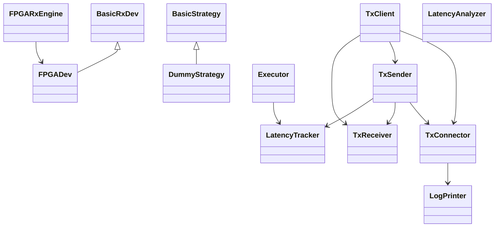
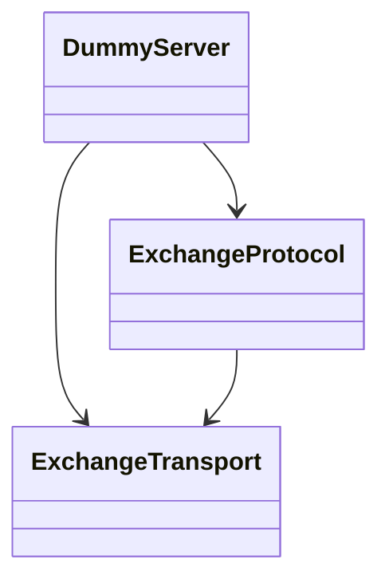

# FPGA_boost_demo Hierarchy

## Source Tree

```text
cpp_src/FPGA_boost_demo/
├── app
├── common
├── driver
├── exchange
├── latency
├── rx_engine
├── strategy
├── sync
├── tests
└── tx_client
```

## UML



## Dummy Server



## Notes

- `app/venturi.cpp` is the top-level orchestrator.
- `driver` and `rx_engine` form the FPGA RX path.
- `TxClient` wraps `TxSender`, `TxReceiver`, and `TxConnector` as one TX communication subsystem.
- `exchange` contains the dummy exchange simulator and protocol stack.
