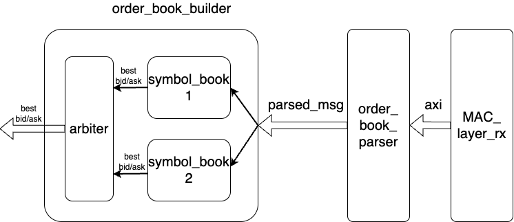
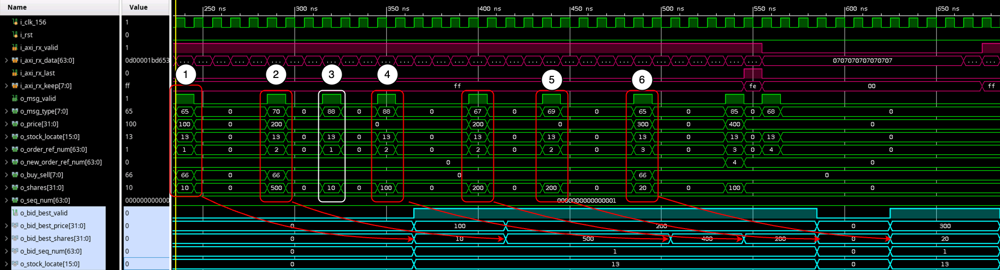

# order_book_builder
This module receives the messages from [order_book_parser](../order_book_parser.md). In side this module, for each configured symbol, it constructs 1. an order book and 2. a bid/ask level book for it. It always outputs the best bid/ask price and the corresponding shares of the symbol.

Inside, there are these modules:

1. [symbol_book](symbol_book/overview.md) x *N*.
2. [arbiter](arbiter.md)

## Hierarchy

Here gives a simply hierarchy of order_book_builder. When parsed messages are input from [order_book_parser](../order_book_parser.md), it will be fanned out to all the [symbol_books](symbol_book/overview.md). Inside, symbol_book will check if the symbol is the configured one and discard the unmatches. Best bid and ask, along with the shares, will be stored in a [fifo](../../FPGA/order_book_builder/symbol_book/fifo.md) inside [symbol_book](symbol_book/overview.md). Round-robin is applied in the [arbiter](arbiter.md). It will decide which [symbol_book](symbol_book/overview.md)'s best bid/ask will be output. 

## Features
- Flexibility: Multiple symbol order book building can be done by instantiating multiple [symbol_book](symbol_book/overview.md) instances.
- Per-symbol event routing by `stock_locate`.
- Round-robin arbitration into one output stream.

## Interface
### Inputs
- `i_clk_156` is the main clock shared with `order_book_parser` and the downstream symbol books.
- `i_rst` is an active-high reset for the wrapper, all `symbol_book` instances, and the arbiter.
- `i_msg_valid` marks one decoded parser event as valid.
- `i_seq_num` carries the sequence number attached to the parser event.
- `i_rx_ingress_tick` carries the packet ingress tick from the receive path. (not used now)
- `i_msg_type` identifies the ITCH message type, such as `A`, `D`, `X`, `U`, `E`, or `F`.
- `i_stock_locate` selects which per-symbol book should consume the event.
- `i_order_ref_num` carries the original order reference number.
- `i_new_order_ref_num` is used by replace messages such as `U`.
- `i_buy_sell` is the ASCII side field from the parser, typically `'B'` or `'S'`.
- `i_shares` carries the event quantity.
- `i_price` carries the event price.
- `i_timestamp` carries the parser timestamp (not used now).
### Outputs
- `o_valid` pulses when the arbiter emits one top-of-book snapshot from any `symbol_book`.
- `o_payload` is a `274-bit` packed snapshot with this layout:
    - `o_payload[273]`:       ask best valid
    - `o_payload[272:241]`:   ask best price
    - `o_payload[240:209]`:   ask best shares
    - `o_payload[208:145]`:   ask sequence number
    - `o_payload[144]`:       bid best valid
    - `o_payload[143:112]`:   bid best price
    - `o_payload[111:80]`:    bid best shares
    - `o_payload[79:16]`:     bid sequence number
    - `o_payload[15:0]`:      stock locate

## Waveform snapshot

Below gives the snapshot of the waveform. 

1. At time 1 (inside the white circle), parsed message arrived. `66` in `o_buy_sell` means *buy*. Thus, we add price `100` (actually 0.01 USD) with shares `100` to the bid side. The light blue waves indicate the change. 
2. At time 2, there is another *buy* signal, price is `200` while shares are `500`. The output best bid and the corresponding shares become to `200` and `500`, respectively. 
3. At time 3, The signal type is 88 in decimal, which means cancel. It cancels the price `100` bid order. In this case the best bid and the shares remain the same. 
4. From time 4 to 5, the shares of `200` is reducing to `0`. 
5. At time 6, there is a new bid order with price `300` and shares `20`, the output best bid and shares change correspondingly.

The *ask* side behaves the same if there are *ask* signals. Note that the best price and shares signals (like `o_bid_best_valid`, etc.) will be all packed to `o_payload`. There signals here are just for demonstration while won't be presented in the module.

Figure here is a little bit small. Zoom in the page to check.

## Limits
- `i_rx_ingress_tick` and `i_timestamp` are not used now.
- The output payload contains only best bids and best ask, not the full depth or raw parser event.
- This wrapper exposes only `o_valid` and `o_payload`; it does not provide an output ready/handshake signal.
