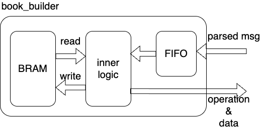

# book_builder
`book_builder` is the order-reference stage inside [symbol_book](../overview.md).
## Introduction
The implementation is in `verilog_src/order_book_related/dependencies/book_builder.v`.
## Design Logic
The module keeps one hashed order table in [bram](bram.md) and translates parser messages into compact quantity updates [qty_book_wrapper](../qty_book_wrapper/overview.md) at the same time. for the downstream bid and ask quantity books.

Below shows the structure of book_builder module.



The public output is:

```text
o_qty_msg = {bid_ask[1:0], price[31:0], is_add, d_shares[31:0], op_done}
```

`op_done` marks when the exported quantity update represents a **completed** book operation from the point of view of the outward top-of-book stream. This is useful for `TYPE_U` message, as it requires two separate book operation.


## Parser Input Format
`i_parser_msg` carries:

```text
{msg_valid, msg_type, stock_locate, order_ref_num, new_order_ref_num, side, shares, price}
```

Only messages with `i_stock_valid = 1` are pushed into the internal FIFO.
## State Machine
The module uses a small FSM because the order table BRAM has synchronous read latency.

- `IDLE`: handle `A/F` immediately or start a read for `D/X/E/C/U`.
- `FIRST_CYCLE`: keep the read active.
- `SECOND_CYCLE`: consume the read result and perform delete, reduce, or the remove phase of `U`.
- `THIRD_CYCLE`: finish the add phase of `U`.

## Order Table
Each BRAM entry stores:

```text
{valid, side[1:0], shares[31:0], price[31:0]}
```

The address is derived from `order_ref_num` by the XOR-folding helper `cal_order_book_addr()`. This keeps the table compact but allows collisions.
## Limits
- The internal FIFO push-ready signal is not consumed, so sustained overflow can drop parser events.
- `cal_order_book_addr()` is a hash, not a collision-free mapping.
