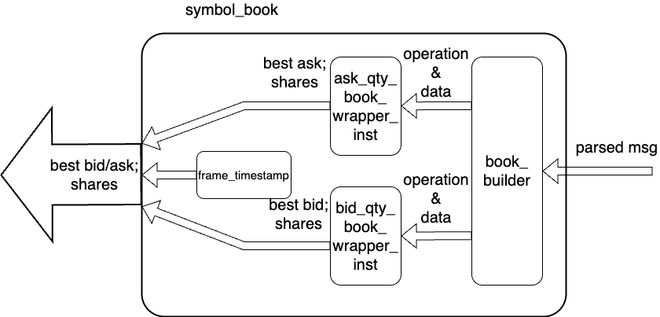

# symbol_book
`symbol_book` is the per-symbol order-book engine used by [order_book_builder](../overview.md).
## Introduction
The implementation is in `verilog_src/order_book_related/dependencies/symbol_book.v`.
## Design Logic
Each instance tracks one configured `STOCK_LOCATE`.

The incoming parser message is always present on `i_parser_msg`, but only matching traffic is allowed to update the internal order table because `book_builder` receives `i_stock_valid`.

The module has four active blocks:

1. [book_builder](book_builder/overview.md): maintains the order-reference table and emits compact quantity updates.
2. ask-side [qty_book_wrapper](qty_book_wrapper/overview.md): tracks ask price levels.
3. bid-side [qty_book_wrapper](qty_book_wrapper/overview.md): tracks bid price levels.
4. `timestamper`: captures a timestamp used in the exported event payload.

`symbol_book` also compares the latest best bid and ask against the previous cycle. When either side changes and the aligned `op_done` pulse says the update is complete, `o_event_found` pulses and `o_payload` carries the new snapshot.

Below gives the inside structure:



## Payload
The exported symbol payload is:

```text
{ask_price[31:0], ask_shares[31:0], bid_price[31:0], bid_shares[31:0], event_timestamp[63:0], stock_locate[15:0]}
```

An empty side is represented by zero shares, and with the current `PRICE_BASE = 0` integration the corresponding price also collapses to zero.
## Why The Output Is Atomic
`book_builder` may need multiple internal cycles to complete one parser message. `qty_book_wrapper` and `tree_builder` add more latency on the price-level path.

The exported event path uses the aligned `op_done` pulse from the ask or bid wrapper:

- internal quantity updates can take several cycles
- the final outward `o_event_found` pulse appears only when the aligned result is ready

That is why the host-visible event stream behaves atomically even though the internal update pipeline is multi-cycle.
## Limits

- The module exports only top-of-book state, not the full order table or all price levels.
