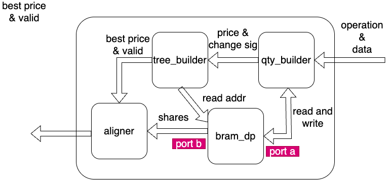

# qty_book_wrapper
`qty_book_wrapper` maintains one side of the price-level quantity book for one symbol.
## Introduction
The implementation is in `verilog_src/order_book_related/dependencies/qty_book_wrapper.v`.
## Design Logic
Each [symbol_book](../overview.md) instantiates two wrappers:

- one ask-side wrapper
- one bid-side wrapper

Both wrappers observe the same `i_qty_msg` stream from [book_builder](../book_builder/overview.md), but each wrapper keeps only the messages whose side matches `BID_OR_ASK`.

The wrapper splits the work into four blocks:

1. [qty_builder](qty_builder.md): read-modify-write update for one touched price level.
2. [tree_builder](tree_builder.md): track which price indices are currently non-empty and pick the best one.
3. [aligner](aligner.md): delay the best-price path so it lines up with the BRAM read result and completion pulse.
4. [bram_dp](bram_dp.md): hold the aggregated shares for all tracked price levels.

These modules and the connections can be found in the figure below:

## Interface
### Inputs
- `i_clk_156`: main clock.
- `i_rst`: active-high reset.
- `i_qty_msg`: `{bid_ask, price, is_add, d_shares, op_done}`.
### Outputs
- `o_best_price_aligned`: aligned best price for this side.
- `o_best_shares`: aligned aggregated shares at that best price.
- `o_op_done_aligned`: aligned completion pulse for the current outward event.
## Data Path
The wrapper updates the touched price level through BRAM port A and reads the current best level through BRAM port B.

`tree_builder` stores only occupancy, not exact quantities. Exact shares stay in BRAM.
## Limits
- Prices below `PRICE_BASE` or beyond the tracked depth collapse to index `0`.
- The wrapper boundary has no backpressure signal.
