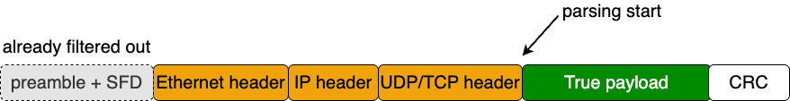
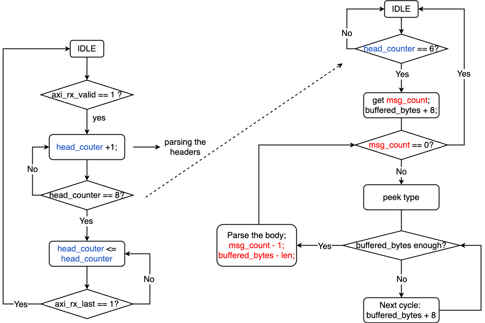
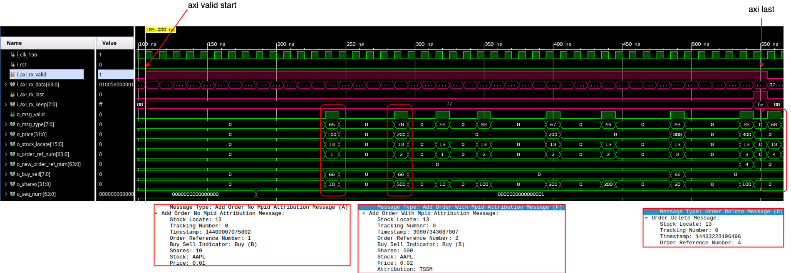

# order_book_parser
Parse order messages packed in ITCH 5.0 in the payload from [MAC_layer_rx](MAC_layer_rx.md). It also drops unrelated messages.

## Design Logic
The module first walks through fixed packet headers, then peeks message count and message type, and finally extracts fields such as `stock_locate`, `order_ref_num`, `shares`, and `price`, as parallel signals to the next module.
### The header
Before pasing the messages, we have to deal with Ethernet head, IP header and UDP/TCP header (The preabmle+SFD has already been filtered out in MAC layer), as illustrated below:



The lengths of headers are always fixed. The parsing of them is easy. We use a **counter** (`head_counter`) to indicate the end of headers.

### The messages

For each message, parsing is not finised until we hit the end from `i_axi_rx_data`. Thus, we have to wait for it (use a buffer). However, The end of the previous message and the start of the next message may be **mixed** in one `i_axi_rx_data`. So, we need another **counter** (`buffed_bytes`).

### States
In the big picture, as stated above, the parsing can be divided into two phases:

1. **header parsing**.
2. **message parsing**.

**header parsing** triggers **message parsing**. The flow chart is shown below:



1. At the begining, **header parsing** will be kicked off when `i_axi_rx_valid == 1`, from which `head_counter` starts to `+1`. 
2. When it reaches `6`, it triggers the **message parsing** phase, It gets `msg_count` and start to buffer. 
3. Every time when `msg_count !=1`, it peeks the type and wait until the buffer has enough bytes. 
4. Once it parsed the message, `msg_count <= msg_count -1;` and `buffered_bytes` will also be subtracted corresponding length.  
5. The peak type -> data to buffer -> parse loop will be exectued again, until `msg_count == 0`. 
6. For unknown types, the `default` case will do nothing except subtract `msg_count` and `buffered_bytes`.


### Control from the host
I want to add control like filtering out frames sent to other IP or MACs, realized by host sending register control signals through PCIe. However, this has nothing to do with the parsing itself, so now it is suspended. Will be realized in the future.

## Interface
### Inputs
- `i_clk_156` is the parser clock.
- `i_rst` clears the header parser, message parser, and output registers.
- `i_axi_rx_data`, `i_axi_rx_valid`, `i_axi_rx_keep`, `i_axi_rx_last`, and `i_axi_rx_ingress_tick` come from `MAC_layer_rx`.
- `i_ctl_dst_mac`, `i_ctl_dst_ip`, `i_ctl_dst_port`, `i_promiscuous`, `i_sync_fire`, and `i_ctl_reg` program the parser settings registers.
### Outputs
- `o_axi_rx_ready` is tied high, so this block always accepts incoming beats.
- `o_msg_valid` pulses when one complete message has been decoded.
- `o_seq_num` and `o_rx_ingress_tick` carry packet-level context.
- `o_msg_type`, `o_stock_locate`, `o_order_ref_num`, `o_new_order_ref_num`, `o_buy_sell`, `o_shares`, `o_price`, and `o_timestamp` carry the parsed order-book fields.


## Sliding Buffer
The module keeps a 512-bit (64 bytes) history window so fields can cross AXI beat boundaries without special cases.
```verilog
reg  [511:0] prev_buff;
wire [511:0] cur_buff = {prev_buff[447:0], i_axi_rx_data};
wire [6:0] valid_bytes = buffed_bytes < 7'd6 ? 7'd0 : buffed_bytes - 7'd6;
```
`prev_buff` is sequential state. `cur_buff` mixes the previous window with the current beat, which lets the parser read the next field one cycle earlier. `valid_bytes` accounts for the fixed 6-byte gap between the current parse boundary and the start of the valid window.

here the `-7'd6` is because the time we parse the message body, we are actually at the half of `seq_num` (`header_counter` is `7`), which is 3 bytes. Plus the `message_count` field, we have total `6 bytes` offset from the buffer starting point.


## State Machine
The body parser is a 5-state machine.

- `IDLE`:
    1. Clear parser-local state such as `prev_buff`, `o_msg_valid`, `buffed_bytes`, `o_msg_type`, and `msg_count`.
    2. Wait until `head_counter == 6`, then move to `PEEKING_MSG_COUNT`.

- `PEEKING_MSG_COUNT`:
    1. Wait for `i_axi_rx_valid`.
    2. Latch the packet message count from `i_axi_rx_data[31:16]`.
    3. Shift the current AXI beat into `prev_buff`, increment `buffed_bytes`, and move to `PEEKING_TYPE`.

- `PEEKING_TYPE`:
    1. Clear the previous decoded message outputs.
    2. If `msg_count == 0`, return to `IDLE`.
    3. Otherwise, wait for `i_axi_rx_valid`, peek the next message type with `take_data(cur_buff, valid_bytes-2, 1)`, shift in the new beat, and move to `PARSING_BODY`.

- `PARSING_BODY`:
    1. If `buffed_bytes >= 64`, enter `ERROR`.
    2. If `valid_bytes` is large enough for `msg_len_bytes(peeked_type)`, decode one full message, decrement `msg_count`, and return to `PEEKING_TYPE`.
    3. Otherwise, keep shifting AXI beats into the sliding buffer until enough bytes are available.

- `ERROR`:
    1. Stop decoding and hold state until `i_axi_rx_last` arrives.
    2. Return to `IDLE` at the end of the packet.

- `PARSING_HEADER`:
    1. This state is declared in the RTL but is not used by the current transition logic.

## Supported Message Types
The parser recognizes seven message types and uses `msg_len_bytes()` to decide when a full message is present.

- `A` (`7'd38`):
    1. Outputs `stock_locate`, `timestamp`, `order_ref_num`, `buy_sell`, `shares`, and `price`.
    2. Skips tracking number and stock symbol.

- `X` (`7'd25`):
    1. Outputs `stock_locate`, `timestamp`, `order_ref_num`, and canceled `shares`.

- `D` (`7'd21`):
    1. Outputs `stock_locate`, `timestamp`, and `order_ref_num`.

- `U` (`7'd37`):
    1. Outputs `stock_locate`, `timestamp`, original `order_ref_num`, `new_order_ref_num`, `shares`, and `price`.

- `E` (`7'd33`):
    1. Outputs `stock_locate`, `timestamp`, `order_ref_num`, and executed `shares`.
    2. Skips match number.

- `F` (`7'd42`):
    1. Outputs `stock_locate`, `timestamp`, `order_ref_num`, `buy_sell`, `shares`, and `price`.
    2. Skips stock symbol and attribution.

- `C` (`7'd38`):
    1. Outputs `stock_locate`, `timestamp`, `order_ref_num`, `shares`, and `price`.
    2. Skips match number, printable flag, and attribution.

- Shared note:
    1. Fields such as tracking number are consumed for alignment but are not exposed at the output interface.

## Field Extraction
`take_data()` reads a field from `cur_buff` by byte index and width, then preserves the original byte order in the output register.
```verilog
take_data[(width_bytes-i)*8-1 -: 8] =
    prev_buff[(index_bytes-i)*8-1 -: 8];
```
This helper is the reason each message case can describe fields in byte offsets instead of manually slicing every possible boundary crossing.

## Waveform snapshot

Below shows an example of the waveform, in which the orders are parsed by this module. The pink waves are axi data comming from [MAC_layer_rx](../FPGA/MAC_layer_rx.md). It can be noted after several cycles (the headers), the messages are parsed out, indicated by `o_msg_valid`. There are also three examples of message `TYPE_A`, `TYPE_F` and `TYPE_U`.




## Design Limits
- `o_axi_rx_ready` is always `1'b1`, so this module provides **no receive backpressure**.
- `i_axi_rx_keep` is present on the interface but is **not used** in the current parser logic.
- The programmable destination filters are stored but **not applied** to gate parsing.
- If `buffed_bytes >= 64`, the parser enters `ERROR` and waits for `i_axi_rx_last`.
