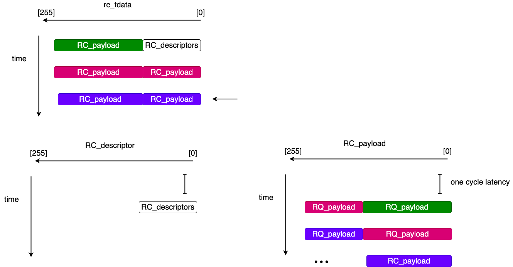

# RC_gearbox256
`RC_gearbox256` realigns the PCIe `RC` completion payload stream so user logic sees a consistent `256-bit` payload channel.
## Introduction
The implementation is in `verilog_src/PCIe_related/dependencies/RC_gearbox256.v`.

Inside [RC_parser](overview.md), this module receives raw `m_axis_rc_*` beats from the PCIe IP core and produces:

- `rc_descriptor`: the `96-bit` completion descriptor captured on SOP
- `rc_payload`: a realigned `256-bit` payload bus
- `rc_valid`, `rc_payload_last`, and `rc_payload_dw_keep`
## Design Logic
The first beat of an `RC` completion is not payload-only. Its lower `96 bits` carry the completion descriptor, while the upper portion carries payload. Later beats are payload-only.

That means the payload stream is **shifted** at the packet boundary. `RC_gearbox256` fixes that by saving the upper `160 bits` of the current beat in `data_saver` and combining them with the lower `96 bits` of the following beat:
```verilog
assign rc_payload = {m_axis_rc_tdata[95:0], data_saver};
```
So the gearbox converts the raw RC beat layout into one stable `256-bit` payload word stream for logic.

On SOP, the module also captures:

- the `96-bit` completion descriptor
- the total completion payload DWord count
- a cached tail keep mask for the last beat

`m_axis_rc_tuser[32]` is used as the SOP indicator in the current RTL.

Below shows the design logic in a figure:



## Payload Last And Keep
The module decides the output tail condition from the completion DWord count.

There are two main cases:

1. **Short completion**: if the total payload is fewer than `8` DWords, the current beat is also the last beat, and `rc_payload_dw_keep` is generated directly from the completion length.
2. **Multi-beat completion**: intermediate beats use `8'hFF`, and the final beat uses the keep pattern cached in `rc_last_keep`.

The helper `calc_tail_keep()` maps a completion length in DWords to the final `8-bit` keep mask.
## Interface
### Inputs
- `clk`: PCIe user clock.
- `rst_n`: active-low reset.
- `m_axis_rc_tdata`
- `m_axis_rc_tvalid`
- `m_axis_rc_tuser`
- `m_axis_rc_tkeep`
- `m_axis_rc_tlast`
### Outputs
- `m_axis_rc_tready`: always `1'b1` in the current implementation.
- `rc_valid`
- `rc_payload_last`
- `rc_payload`
- `rc_payload_dw_keep`
- `rc_descriptor`
## Handshake
The current gearbox is always ready:
```verilog
assign m_axis_rc_tready = 1'b1;
```
So every valid RC beat is accepted immediately. There is **no internal stall path** in the current implementation.
## Limits
- The implementation is written for `DATA_WIDTH = 256`.
- The logic assumes a `96-bit` descriptor in the low part of the SOP beat.
- `m_axis_rc_tkeep` is present on the interface but is not used by the current realignment logic.
