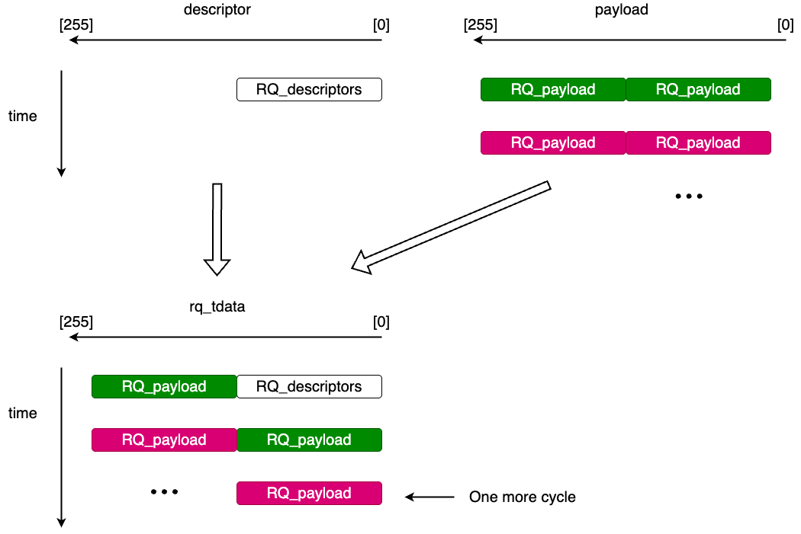

# RQ_gearbox256
This module packs the requester descriptor and payload stream into the `256-bit` `s_axis_rq_*` format required by the PCIe IP core. In this design, it is the beat-level packing stage under [RQ_formatter](overview.md).
## Introduction
The implementation is in `verilog_src/PCIe_related/dependencies/RQ_gearbox256.v`.

Inside [RQ_formatter](overview.md), this module receives:

- a `128-bit` requester descriptor
- a `256-bit` payload stream from user logic
- packet-boundary signals such as `rq_payload_sop` and `rq_payload_last`

Its output is the AXI-Stream `RQ` channel toward the PCIe IP core.
## Design Logic
The original PCIe `RQ` stream does not carry the request descriptor and payload as two separate channels. They must be packed together into `256-bit` beats with the proper `tkeep`, `tlast`, and `tuser` values.

`RQ_gearbox256` performs that packing.

At a high level:

1. place the `128-bit` descriptor in the lower half of the first beat
2. place payload data beside or after the descriptor depending on packet size
3. save the upper `128-bit` portion of a payload beat when alignment requires it
4. emit a final partial beat when the remaining payload cannot fit into the previous beat

This is why the module is called a **gearbox**: it converts the logic-side payload stream into the beat alignment expected by the PCIe `RQ` interface.

Below shows the design logic in a figure:

## Interface
### Inputs
- `clk`: PCIe user clock
- `rst_n`: active-low reset
- `rq_descriptor`: `128-bit` requester descriptor
- `rq_payload`: `256-bit` payload input
- `rq_payload_dw_count`: total payload size in DWords
- `rq_payload_last`: final payload beat from user logic
- `rq_valid`: payload beat valid
- `rq_payload_sop`: first payload beat
- `s_axis_rq_tready`: ready from the PCIe IP core
### Outputs
- `rq_ready`: ready back to [RQ_formatter](overview.md)
- `s_axis_rq_tdata`: packed `256-bit` RQ data
- `s_axis_rq_tvalid`
- `s_axis_rq_tuser`
- `s_axis_rq_tkeep`
- `s_axis_rq_tlast`
- 
## Relation To RQ_formatter
The division of work is:

- [RQ_formatter](overview.md): builds the requester descriptor
- `RQ_gearbox256`: packs descriptor and payload into AXI-Stream beats

So `RQ_formatter` decides **what** request to send, while `RQ_gearbox256` decides **how** that request is placed onto the `256-bit` PCIe stream.
## Limits
- The implementation is written for `DATA_WIDTH = 256`.
- The packing logic assumes a `128-bit` requester descriptor placed only in the first output beat.
- `rq_ready` is deasserted while an internally generated extra tail beat is pending, so upstream logic must hold its current request state until the gearbox is ready again.
