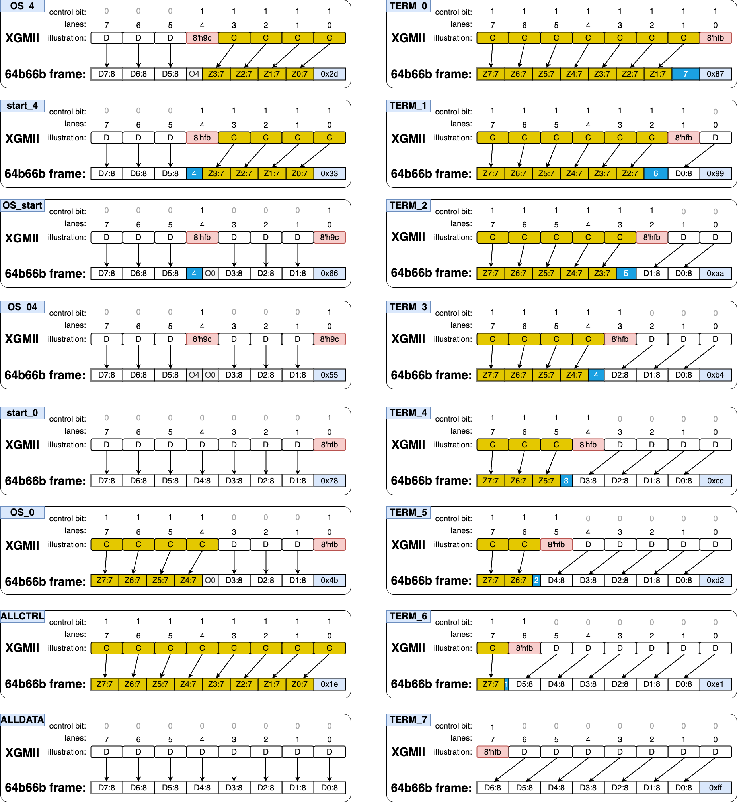

# pcs_pma_wrapper

1. It can be replaced by a well-designed **pcs_pma IP core**. However, this does not work in my board. So, I just copied the gtwizard IP core and the related official design example to replace it.
2. One thing needs to mind is that the **tx** polarity is asserted while the rx is not, which means the tx differential lines are swapped in this board.
3. One thing I can share: The mapping from **xgmii** to **64b66b**, as well as the **64b66b frame structure**. You can also use it vice versa. I provide them below:
4. The mapping covers all the possiblities, you can use combinational logic to do the decode (encode). I may expand this part later.

